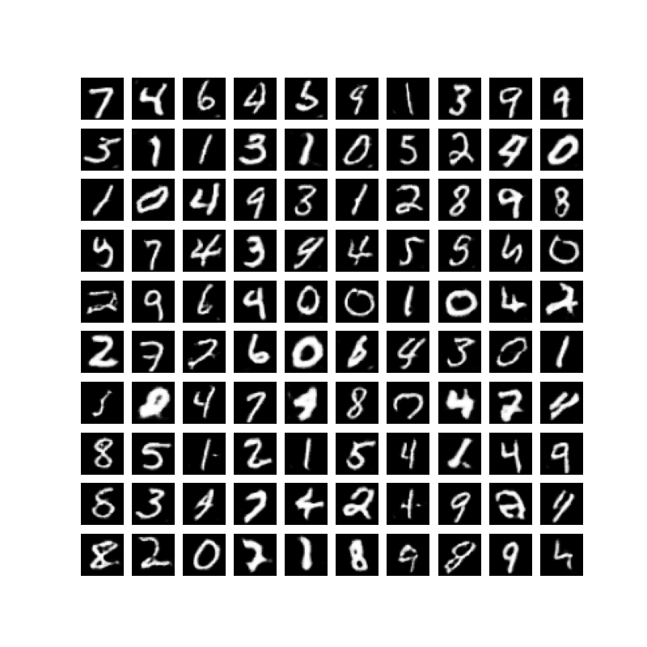

<div align="center">    
 
# Deep Convolutional GANs with PyTorch

</div>
 
## Description   
Pytorch implementation of the deep convolutional GAN paper titled "Unsupervised Representation Learning with Deep Convolutional Generative Adversarial Networks" using PyTorch. Link to the original paper by [Radford, A., Metz, L. and Chintala, S](./papers/dc-gans.pdf). You can also find the vanilla GAN paper by [Goodfellow, I. et al.](./papers/gans.pdf) for training details.

## How to run   
First, install dependencies (a new python virtual environment is recommended).   
```bash
# clone project   
git clone https://github.com/visualCalculus/deep-convolutional-gan

# install project   
cd deep-convolutional-gan
pip install -e .
pip install -r requirements.txt
 ```   
 Next, navigate to dcgan folder and run train.py with appropriate command line arguments.  
 ```bash
# module folder
cd dcgan

# run module
python train.py --gpus=1 --max_epochs=5 --dataset=MNIST --image_size=32 --batch_size=128 --z_dim=100
--z_filter_shape=2 --n_channels=1 --learning_rate=2e-4 --beta1=0.5

```

## Results
<div align="center">

DCGAN trained for 10 epochs on MNIST. 

DCGAN trained for 50 epochs on CIFAR10.


</div>

### Citation  
```
@misc{visualCalculus2021dcgan,
  title={deep-convolutional-gan},
  author={Tejomay, Abhiroop},
  publisher={GitHub}
  journal={GitHub repository},
  year={2021},
  howpublished={\url{https://github.com/visualCalculus/deep-convolutional-gan}}
}
```   

